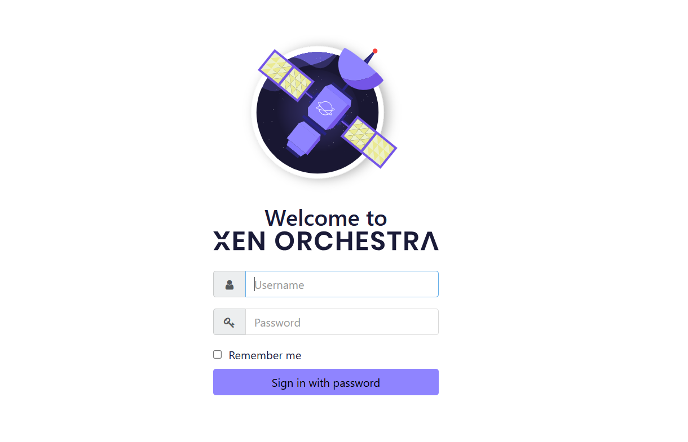
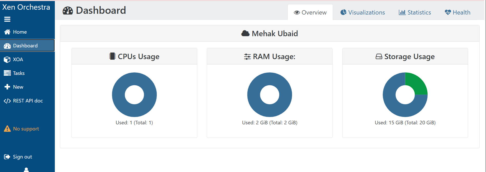

# Welcome to NIT Academy - Day 1

> **Student:** Mehak Ubed
> **Day-1:** Saturday 9th May, 2026

## Table of Contents

| Task | Title                  | Summary                        |
| ---- | ---------------------- | ------------------------------ |
| 1    | Access Virtual Machine | Login and access Linux VM      |
| 2    | Linux Shell Basics     | Learn basic Linux commands     |
| 3    | GitHub Account         | Create and configure GitHub    |
| 4    | LinkedIn Profile       | Create or update LinkedIn      |
| 5    | Git Bash               | Install and configure Git Bash |
| 6    | Visual Studio Code     | Install VS Code                |
| 7    | Discord                | Join NIT Discord Server        |

---

# Linux Journey Begins

Please take this seriously and complete all assignments on time.

---

# Task 1 - Access Virtual Machine

## Objective

Access your Linux Virtual Machine and log in successfully.

### Login Page



### Virtual Machine Dashboard




### Login Credentials

```text
Username: root
Password: ********
```

### Disable IPv6

```bash
sysctl -w net.ipv6.conf.all.disable_ipv6=1
sysctl -w net.ipv6.conf.default.disable_ipv6=1
```

### Result

Successfully accessed the Virtual Machine and disabled IPv6.

---

# Task 2 - Linux Shell Basics

## Objective

Understand the Linux Shell and practice basic commands.

### Commands Practiced

```bash
whoami
pwd
ls
date
clear
ip a
hostnamectl
uptime
passwd
exit
```

### Sample Output


### Learning Outcomes

* Understood the Linux Shell
* Learned how commands are interpreted
* Practiced basic Linux commands
* Navigated directories using CLI

---

# Task 3 - GitHub Account

## Objective

Create and configure a GitHub account.

### GitHub Profile


### Learning Outcomes

* Created GitHub account
* Verified email address
* Created first repository
* Learned repository structure

---

# Task 4 - LinkedIn Profile

## Objective

Create or update a professional LinkedIn profile.


### Learning Outcomes

* Updated professional profile
* Added profile photo
* Added educational information
* Started building professional presence

---

# Task 5 - Git Bash

## Objective

Install and configure Git Bash.


### Verify Git

```bash
git --version
```

### Configure Git

```bash
git config --global user.name "Mehak Ubed"
git config --global user.email "moonmehakk@gmail.com"
```

### Learning Outcomes

* Installed Git Bash
* Configured Git username
* Configured Git email
* Verified installation

---

# Task 6 - Visual Studio Code

## Objective

Install Visual Studio Code.

### VS Code Installation


### Learning Outcomes

* Installed Visual Studio Code
* Opened first project
* Familiarized with VS Code interface

---

# Task 7 - Discord

## Objective

Join the NIT Discord Community.

### Discord Server


### Learning Outcomes

* Joined Discord server
* Connected with community members
* Accessed communication channels

---

# Final Summary

Today I learned:

* Accessing Linux Virtual Machines
* Linux Shell fundamentals
* Basic Linux commands
* GitHub account creation
* Git Bash installation and configuration
* Visual Studio Code setup
* Discord community onboarding

## Author

**Mehak Ubed**
NIT Academy – Linux, DevOps & SRE Learning Journey 🚀
