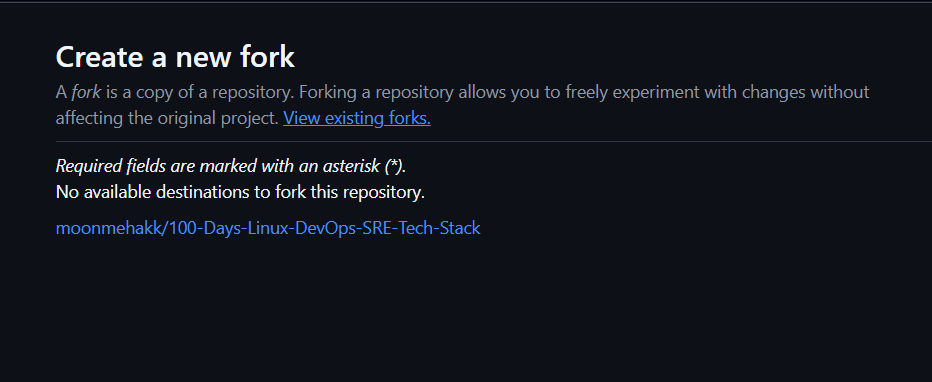

# Welcome to NIT Academy - Day 06

> **Student:** Mehak Ubed
> **Day-06:** Thursday 14th May, 2026

---

# Table of Contents

| Task | Title                    | Summary                                  |
| ---- | ------------------------ | ---------------------------------------- |
| 1    | Guest Tools Patching     | Install and validate Xen Guest Utilities |
| 2    | Post-Patching Validation | Verify successful agent detection        |
| 3    | LinkedIn Challenge       | Share patching progress on LinkedIn      |

---

# Introduction

Patching is one of the most common responsibilities of Linux Administrators, System Engineers, and DevOps professionals.

During Day 06, students were required to perform a mandatory patching activity to resolve the **"Management Agent Not Detected"** warning inside Xen Orchestra.

This activity ensures that the virtual machines are properly monitored and optimized within the NIT Academy infrastructure.

---

# Learning Objectives

By completing Day 06, I learned how to:

* Perform system patching
* Enable software repositories
* Install Guest Utilities
* Validate service status
* Verify monitoring agent functionality
* Understand the importance of system maintenance

---

# Task 1 - Guest Tools Patching

## Objective

Install Xen Guest Utilities to resolve the management agent warning.

### Step 1 - Install EPEL Repository

```bash
dnf install -y epel-release
```

### Step 2 - Install Guest Utilities

```bash
dnf install -y xe-guest-utilities-latest
```

### Purpose

These packages allow Xen Orchestra to properly communicate with and monitor the virtual machine.

---

# Task 2 - Post-Installation Validation

## Enable and Start Service

Run:

```bash
systemctl enable --now xe-linux-distribution
```

## Verification

Confirm that the service starts successfully and the management agent becomes active.

### Successful Output



### Outcome

* Guest Utilities installed successfully
* Xen Distribution Service enabled
* Agent detection warning resolved
* Virtual machine monitoring restored

---

# Task 3 - LinkedIn Challenge

## Objective

Document learning progress publicly.

### LinkedIn Activity

After patching was completed:

1. Captured terminal output
2. Verified "Agent Detected" status
3. Shared progress on LinkedIn

### Required Hashtag

```text
#NIT
```

---

# Interview Question

## Have You Done Patching?

### Sample Answer

Yes, I have performed patching activities on Linux systems. During my NIT Academy training, I installed and updated system packages, enabled repositories, installed Xen Guest Utilities, and validated services to resolve monitoring agent issues. I also verified successful deployment and service functionality after patching.

---

# Skills Learned

During Day 06, I gained experience in:

* Linux patching procedures
* Repository management
* Package installation
* Service management using systemctl
* Infrastructure monitoring concepts
* Troubleshooting agent-related issues

---

# Final Summary

Today I learned how to:

* Install Linux packages
* Enable repositories
* Patch virtual machines
* Manage Linux services
* Verify successful patch deployment
* Resolve monitoring agent issues

This was my first hands-on patching activity and an important step toward Linux System Administration.

---

# Author

**Mehak Ubed**
NIT Academy – Linux, DevOps & SRE Learning Journey 🚀
