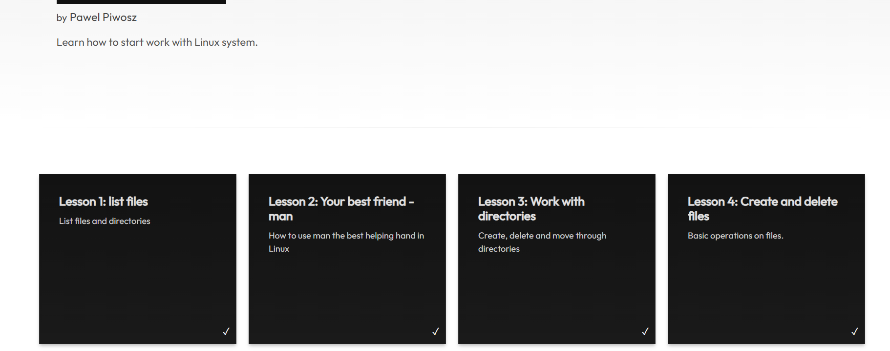

# Practice Lab - Day 12

> 20th May, 2026

## Objective

Learn basic Linux commands and filesystem navigation through hands-on labs using Killercoda.

---

# Task 1 - Access Killercoda

Open:

```text
https://killercoda.com
```

Complete the Linux learning module available on the platform.



---

# Task 2 - Select the Linux Module

Choose the Linux learning path and start the guided exercises.

## Goal

Learn Linux through interactive browser-based labs without installing anything locally.

---

# Task 3 - Complete All Four Lessons

You must complete all four Linux lessons provided in the Killercoda Linux module.

Lessons include:

1. List Files
2. Using the man Command
3. Working with Directories
4. Creating and Deleting Files

---

# Task 4 - Lesson 1: List Files

Practice basic file listing commands.

Commands used:

```bash
ls
ls -l
ls -a
pwd
```

### What I Learned

* How to view files and directories
* Difference between normal and detailed listings
* How to identify hidden files

---

# Task 5 - Lesson 2: Your Best Friend "man"

Practice using Linux manual pages.

Commands used:

```bash
man ls
man pwd
man mkdir
```

### What I Learned

* How to access command documentation
* Understanding command options and syntax
* Finding help directly from the terminal

---

# Task 6 - Lesson 3: Work with Directories

Practice Linux navigation.

Commands used:

```bash
pwd
cd
cd ..
mkdir testdir
```

### What I Learned

* Navigating between directories
* Creating new directories
* Understanding absolute and relative paths

---

# Task 7 - Lesson 4: Create and Delete Files

Practice file management.

Commands used:

```bash
touch file1.txt
rm file1.txt
```

### What I Learned

* Creating files
* Removing files
* Basic file management operations

---

# Final Submission

## Questions & Answers

### Have you enjoyed working with Linux Commands?

Yes. Linux commands provide a fast and efficient way to manage systems and perform tasks.

### Which Linux Commands Did You Practice?

```bash
ls
pwd
cd
mkdir
touch
rm
man
```

### Which Lesson Was Most Interesting?

Working with directories because it helped me understand Linux filesystem navigation.

### What Did You Learn From Killercoda?

Killercoda provided a practical environment to practice Linux commands, filesystem navigation, file management, and command documentation without requiring a local Linux installation.

---

# Final Reflection

Today I completed the Killercoda Linux practice labs and gained hands-on experience with Linux commands, directory navigation, file management, and Linux manual pages. The interactive environment helped reinforce concepts learned in previous NIT sessions and improved my confidence using the Linux terminal.
