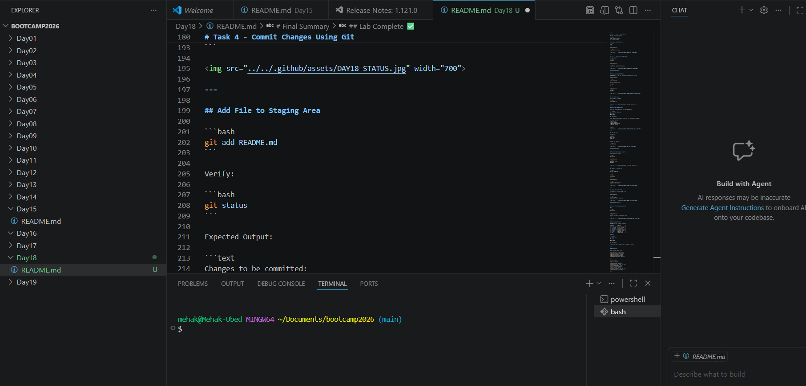
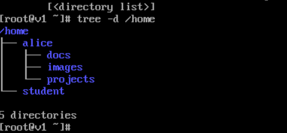
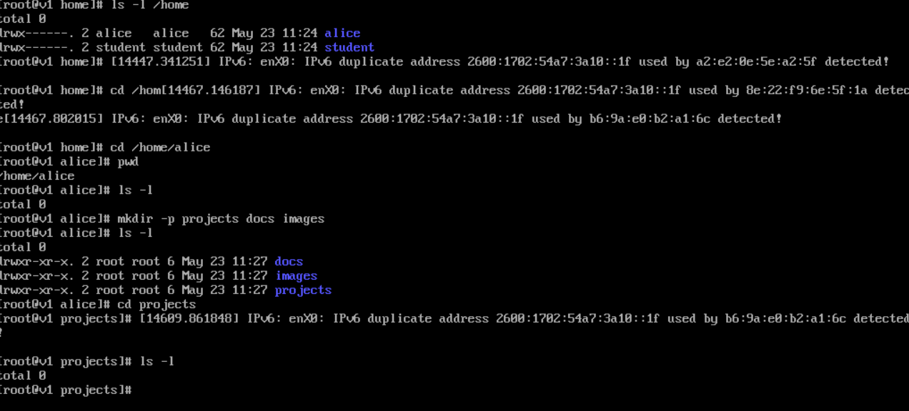

# Welcome to NIT Academy - Day 18

> **Day-18: Creating a Professional README File**
> **Student:** Mehak Ubed

---

## Table of Contents

| Task | Title                     | Summary                     |
| ---- | ------------------------- | --------------------------- |
| 1    | Create a Local Repository | Initialize a Git repository |
| 2    | Create a README File      | Create and edit README.md   |
| 3    | Add Markdown Content      | Build a professional README |
| 4    | Commit Changes            | Save your work using Git    |
| 5    | Verify Repository         | Confirm repository status   |

---

# We Are Continuing Our Linux Journey

Please take this seriously and complete all assignments on time.

Today we will learn how to create a professional **README.md** file, which serves as the documentation for every GitHub project.

---

# Task 1 - Create a Local Repository

## Step 1 - Open Your Linux Terminal


Open your Linux Virtual Machine and log in.

```text
Username: root
Password: ********
```

Expected Login Screen:


---

## Step 2 - Create a Project Directory

Run the following commands:

```bash
mkdir my-first-project
cd my-first-project
```

Verify your current directory:

```bash
pwd
```

Expected Output:

```text
/root/my-first-project
```


---

## Step 3 - Initialize Git Repository

Initialize Git:

```bash
git init
```

Expected Output:

```text
Initialized empty Git repository
```


### Task Complete ✅

---

# Task 2 - Create a README File

A README file is the main documentation file for any project.

Create the file:

```bash
touch README.md
```

Verify the file exists:

```bash
ls
```

Expected Output:

```text
README.md
```


---

## Open README File

Edit the file using Nano:

```bash
nano README.md
```


---

# Task 3 - Add README Content

Paste the following content into your README file:

```markdown
# My First Git Repository

## Author
Mehak Ubed

## Description

This repository was created during Day 18 training at NIT Academy.

## Skills Learned

- Git Basics
- Linux Commands
- Markdown Formatting
- Version Control
```

Example:


---

## Save the File

Inside Nano:

```text
CTRL + O
Press Enter
CTRL + X
```

Display the contents:

```bash
cat README.md
```


### Task Complete ✅

---

# Task 4 - Commit Changes Using Git

Check repository status:

```bash
git status
```

Expected Output:

```text
Untracked files:
README.md
```




---

## Add File to Staging Area

```bash
git add README.md
```

Verify:

```bash
git status
```

Expected Output:

```text
Changes to be committed:
new file: README.md
```


---

## Create Your First Commit

```bash
git commit -m "Initial README file"
```

Expected Output:

```text
1 file changed
create mode 100644 README.md
```


### Commit Successful ✅

---

# Task 5 - Verify Repository Status

Run:

```bash
git status
```

Expected Output:

```text
nothing to commit, working tree clean
```


---

# Understanding Markdown

README files use Markdown formatting.

| Syntax        | Result          |
| ------------- | --------------- |
| `# Heading`   | Main Heading    |
| `## Heading`  | Sub Heading     |
| `### Heading` | Smaller Heading |
| `**Bold**`    | **Bold Text**   |
| `*Italic*`    | *Italic Text*   |
| `- Item`      | Bullet List     |
| `code`        | Code Block      |

Example:

```markdown
# Project Name

## Author

Mehak Ubed

## Description

This project was created during NIT Academy training.
```

---

# Best Practices

When creating README files:

* Use meaningful project names
* Include project descriptions
* Add installation instructions
* Document important commands
* Keep formatting consistent
* Update documentation regularly

---

# Final Summary

Today you learned:

* Creating a Git repository
* Initializing Git using `git init`
* Creating README.md files
* Editing files using Nano
* Using Markdown syntax
* Staging files with `git add`
* Creating commits with `git commit`
* Checking repository status

---

## Lab Complete ✅

Congratulations **Mehak Ubed**!

You have successfully created your first professional README file and committed it to a Git repository.

This skill is used daily by Linux Administrators, DevOps Engineers, Cloud Engineers, and Software Developers around the world.

**Welcome to Day 18 of your Linux and Git journey at NIT Academy!**
