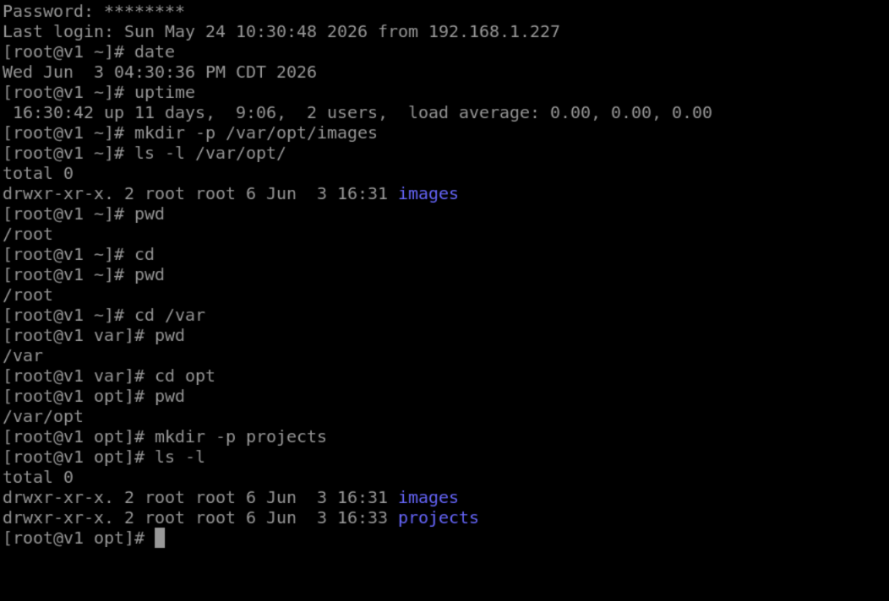
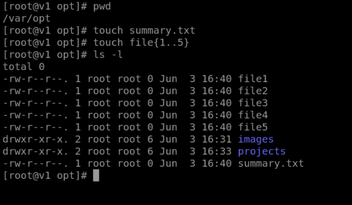

# Day 21 - Linux Practice Lab: Directories and Files

### Mehak Ubed

> Date: May 29th, 2026

---

## Objective

This lab focused on practicing basic Linux commands, understanding filesystem navigation, creating directories using Absolute and Relative Paths, and creating files using the `touch` command.

---

## Commands Practiced

```bash
date
uptime
pwd
mkdir -p /var/opt/images
cd
cd /var
cd opt
mkdir -p projects
touch summary.txt
touch file{1..5}
ls -l
```

---

## What I Learned

In this lab, I learned how to display the current system date and time using the `date` command and check system uptime using the `uptime` command. I also practiced using the `pwd` command to identify my current location in the Linux filesystem.

I created directories using both Absolute and Relative Paths. The directory `images` was created using an Absolute Path because the complete filesystem path was specified. The directory `projects` was created using a Relative Path because it was created from the current working directory.

I also learned how to create files using the `touch` command and how to create multiple files at once using brace expansion.

---

## Absolute Path vs Relative Path

### Absolute Path

An Absolute Path starts from the root directory (`/`) and specifies the complete location of a file or directory.

Example:

```bash
mkdir -p /var/opt/images
```

### Relative Path

A Relative Path starts from the current working directory.

Example:

```bash
mkdir -p projects
```

The main difference is that an Absolute Path always begins from the root (`/`), while a Relative Path depends on the current directory.

---

## Most Useful Command

The most useful command for me was:

```bash
pwd
```

because it helps me quickly identify my current location in the Linux filesystem.

---

## New Command Learned

The command that was new to me was:

```bash
touch file{1..5}
```

It creates multiple files at once using brace expansion, which saves time and improves efficiency.

---

## Summary

This lab improved my understanding of Linux filesystem navigation, directory creation, and file management. I practiced working with Absolute and Relative Paths, learned how to create multiple files efficiently, and strengthened my confidence in using basic Linux commands that are commonly used by Linux Administrators.

## Lab Screenshot





#NIT #Linux #DevOps #GitHub #100DaysOfLinux
