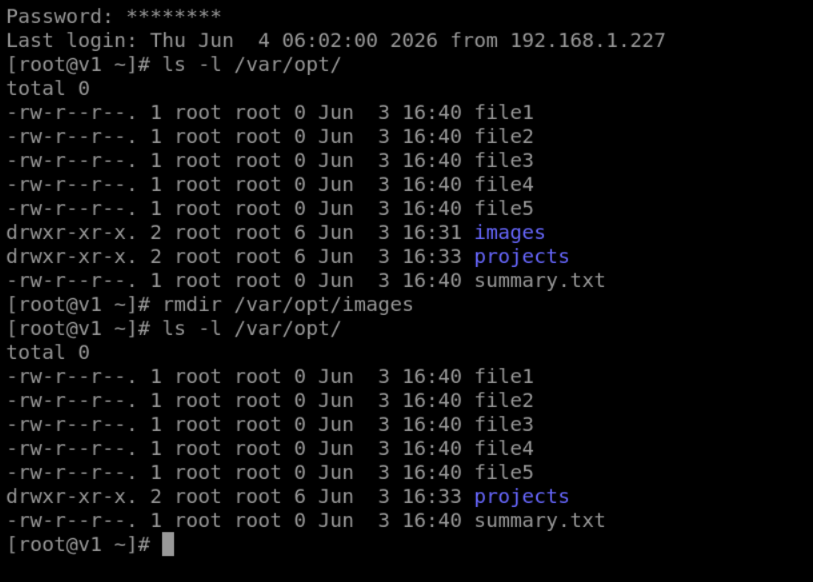
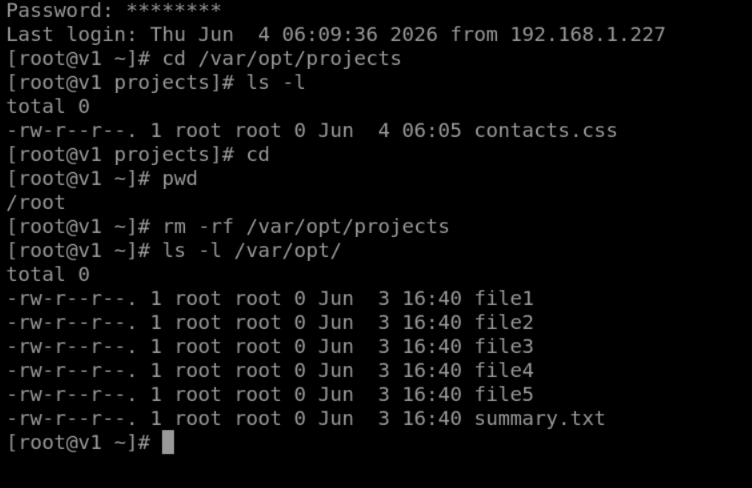
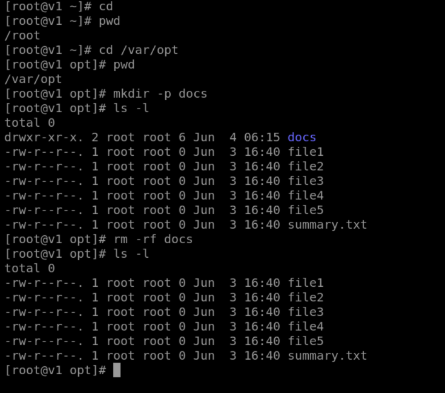
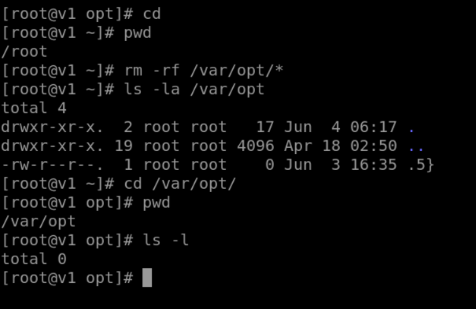

# Linux Lab 22 – Deleting Directories and Files

**Day 22 – 30th May 2026**

## Overview

In this lab, I practiced managing directories and files in Linux. I learned how to delete empty directories, remove non-empty directories, work with absolute and relative paths, and safely clean up directory contents using different Linux commands.

---

## Task 1 – Checking Existing Directories and Files

I reviewed the directories and files created during the previous lab inside `/var/opt`.

### Screenshot



---

## Task 2 – Deleting Empty and Non-Empty Directories

I successfully removed an empty directory using the `rmdir` command.

After creating a file inside the `projects` directory, I attempted to remove it again using `rmdir` and received an error because the directory was no longer empty.

### Screenshot



---

## Task 3 – Removing a Non-Empty Directory

I used the `rm -rf` command to delete the `projects` directory along with all files inside it.

### Screenshot



---

## Task 4 – Working with Relative Paths

I created a new directory named `docs` inside `/var/opt` and removed it using a relative path command.

I also practiced deleting all contents inside `/var/opt` while keeping the parent directory intact.

### Screenshot



---

## Review Questions

### 1. What is the difference between `rmdir` and `rm -rf`?

* `rmdir` removes only empty directories.
* `rm -rf` removes directories and all their contents recursively.

### 2. Why did `rmdir` fail when the directory contained a file?

Because `rmdir` can only remove empty directories.

### 3. What is an Absolute Path?

An absolute path starts from the root directory `/` and specifies the complete location of a file or directory.

Example:

```bash
/var/opt/projects
```

### 4. What is a Relative Path?

A relative path specifies a location based on the current working directory.

Example:

```bash
docs
```

### 5. Why was `rm -rf docs` considered a Relative Path command?

Because I was already inside `/var/opt`, so only the directory name was needed.

### 6. What does the `-r` option do?

It removes directories and their contents recursively.

### 7. What does the `-f` option do?

It forces deletion without asking for confirmation.

### 8. What command removes all contents inside `/var/opt` while keeping `/var/opt` itself?

```bash
rm -rf /var/opt/*
```

---

## Lab Summary

In this lab, I learned how to manage and delete files and directories in Linux using commands such as `rmdir` and `rm -rf`. I understood the difference between deleting empty and non-empty directories and practiced using both absolute and relative paths. The most useful command was `rm -rf` because it can remove directories and all their contents efficiently. The concept that was new to me was understanding when to use `rmdir` versus `rm -rf` and how relative paths simplify file management.
