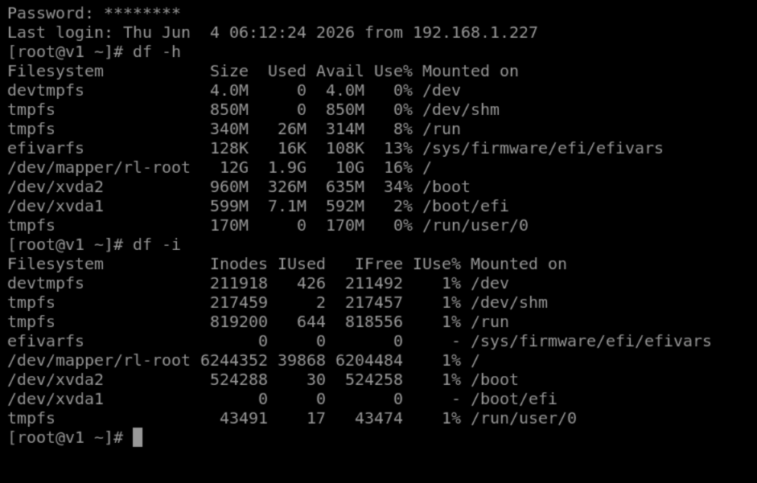

# Linux Lab 23 – Understanding Inodes and Inode Exhaustion

**Day 23 – 31st May 2026**

## Objective

In this lab, I learned about Linux inodes, inode usage, disk space usage, and why monitoring both is important for system administration.

---

## Lab Screenshot



---

# Task 1 – View Disk Space Usage

### Questions & Answers

**1. What filesystems are displayed?**

* devtmpfs
* tmpfs
* efivarfs
* /dev/mapper/rl-root
* /dev/xvda2
* /dev/xvda1

**2. Which filesystem contains the root (`/`) directory?**

```text
/dev/mapper/rl-root
```

**3. How much disk space is available?**

The root filesystem has:

```text
10 GB Available
```

---

# Task 2 – View Inode Usage

### Questions & Answers

**1. How many inodes are available?**

```text
6,244,352
```

**2. How many inodes are currently in use?**

```text
39,868
```

**3. What percentage of inodes are being used?**

```text
1%
```

---

# Task 3 – Compare Disk Usage and Inode Usage

### Questions & Answers

**1. What does `df -h` show?**

`df -h` displays filesystem disk space usage, including total size, used space, available space, and mount points.

**2. What does `df -i` show?**

`df -i` displays inode usage, including total inodes, used inodes, free inodes, and inode utilization percentage.

**3. Why are both commands important?**

Both commands help administrators monitor storage resources. A filesystem needs both free disk space and free inodes to create new files.

---

# Review Questions

### 1. What is an inode?

An inode is a data structure that stores metadata about a file or directory.

### 2. What information is stored in an inode?

* Owner
* Permissions
* File size
* Timestamps
* Data block locations

### 3. Does an inode store the filename?

No. The filename is stored in the directory entry.

### 4. What command displays disk space usage?

```bash
df -h
```

### 5. What command displays inode usage?

```bash
df -i
```

### 6. Can a filesystem have free disk space but no free inodes?

Yes.

### 7. What happens when all inodes are consumed?

Users cannot create new files or directories.

### 8. Why does Linux display "No space left on device" when no inodes remain?

Because every file requires an inode. Without free inodes, Linux cannot create new files even if disk space exists.

### 9. Why do administrators monitor both disk usage and inode usage?

To prevent storage-related issues and ensure systems can continue creating files normally.

### 10. What command can be used to check inode utilization on a filesystem?

```bash
df -i
```

---

# Lab Summary

In this lab, I learned that an inode is a special Linux data structure used to store file metadata. I also learned the difference between disk space usage and inode usage by using the commands `df -h` and `df -i`. A system can report "No space left on device" even when free disk space exists if all available inodes have been consumed. The most useful command in this lab was `df -i` because it provided detailed information about inode utilization and helped me understand how Linux manages files internally.
